<div align="center">



<table>
<tr>
<td width="50%" valign="top">

```
~/profile.ascii

******+*******************************++++++++
**************************************++++++++
************+-----:::::----=+**********+++++++
*********+::.................:-+*******+++++**
********+:.. .......::. . ..::::-*************
##******-....      .... ... ...:.:************
####****+:.....:-++=-::...      . =#**********
######***:  :+#@@@@@%###*+=: .....-#**********
########+ .:#%%@@@@@@%%##**=: . . :########*##
########*. =%%@@@@@@@@@%#**+=.  ..-###########
########%= *#+***#%%#*+----===: . +%##########
#########*:*+==-:-*#+::------=-. :%###########
##########+##++-=*%@++**---=++=..=%%%%%%%%####
%%%%%%%%%%#%%%##%%%%+*%######*+:==#%%%%%%%%%%%
%%%%%%%%%%#%@@@@@@@@#*#%@@%%#+=:-+%%%%%%%%%%%%
%%%%%%%%%%##@@@@@##*==+%@%#*+=-:-*%%%%%%%%%%%%
%%%%%%%%%%##%%%**==*=---=**+=-:-*%%%%%%%%%%%%%
%%%%%%%%%%%+#%*=+*###+==-=+=-:.*@@%@@@@@%%%%%%
%%%%%%%%%%@#-*#%@#+-=*##*=-::.:@@@@@@@@@@@@%%%
%%%%%%%@@@@@*-=#%*++++**=::...+@@@@@@@@@@@@@@%
%%@@@@@@@@@@@#-.-:-::........=@+=@@@@@@@@@@@@@
%@@@@@@@@@@@@@%=:.........:+#@*. -%@@@@@@@@@@@
%%%%@@@@@@@@@@@*+++==-:-=*%@@+  . :*%@@@@@%%%%
%%%%%@@@@@@%#*@@#**++*#@@@@@= ......:-+*%@@@@@
%@@@@@@%#+-: -@@@%#%@@@@@@@- ....:..::::-=+*##
@@@%#+-:...:.+@#=--*@@@@@@=....:::.:::::::::--
> whoami_
```

</td>
<td width="50%" valign="top">

```
sohaib@dev:~$
```

## Hi 👋, I'm **Sohaibdev**

`$` Every line of code I write has a purpose: making the
experience smoother, faster, and more intuitive.

```
> Location:   Wah Cantt, Pakistan
> Education:  Riphah International University
> Role:       Software Engineer (Frontend) @ CapregSoft
> Focus:      Building fast, intuitive user experiences
> Portfolio:  sohaibshakeel.vercel.app
> Email:      muhammadsohaibshakeel18@gmail.com
```

**SKILLS**


[](https://github.com/sohaib-library)
[](https://sohaibshakeel.vercel.app/)
[](mailto:muhammadsohaibshakeel18@gmail.com)

</td>
</tr>
</table>

</div>


<br>

- 🔭 I'm currently working as a **Software Developer**
- 🌱 I'm currently learning **Go and the Gin framework**
- 👯 I'm looking to collaborate on **open source projects**
- 🤝 I'm looking for help with **learning system design**
- 💬 Ask me about **React.js, Next.js, and Go (Gin, Echo) for backend**
- 📫 Reach me at **muhammadsohaibshakeel18@gmail.com**
- 👨‍💻 All my projects: **[sohaibshakeel.vercel.app](https://sohaibshakeel.vercel.app/)**

<h3 align="left">Connect with me:</h3>
<p align="left">
<a href="https://github.com/sohaib-library" target="blank"></a>
<a href="https://www.linkedin.com/in/muhammad-sohaib-shakeel-b67123324/" target="blank"></a>
</p>

<h3 align="left">Languages and Tools:</h3>
<p align="left">
<a href="https://developer.mozilla.org/en-US/docs/Web/aws" target="_blank" rel="noreferrer"></a>
<a href="https://developer.mozilla.org/en-US/docs/Web/bootstrap" target="_blank" rel="noreferrer"></a>
<a href="https://developer.mozilla.org/en-US/docs/Web/css3" target="_blank" rel="noreferrer"></a>
<a href="https://developer.mozilla.org/en-US/docs/Web/docker" target="_blank" rel="noreferrer"></a>
<a href="https://developer.mozilla.org/en-US/docs/Web/git" target="_blank" rel="noreferrer"></a>
<a href="https://developer.mozilla.org/en-US/docs/Web/go" target="_blank" rel="noreferrer"></a>
<a href="https://developer.mozilla.org/en-US/docs/Web/html5" target="_blank" rel="noreferrer"></a>
<a href="https://developer.mozilla.org/en-US/docs/Web/javascript" target="_blank" rel="noreferrer"></a>
<a href="https://developer.mozilla.org/en-US/docs/Web/mongodb" target="_blank" rel="noreferrer"></a>
<a href="https://developer.mozilla.org/en-US/docs/Web/nextjs" target="_blank" rel="noreferrer"></a>
<a href="https://developer.mozilla.org/en-US/docs/Web/postgresql" target="_blank" rel="noreferrer"></a>
<a href="https://developer.mozilla.org/en-US/docs/Web/react" target="_blank" rel="noreferrer"></a>
<a href="https://developer.mozilla.org/en-US/docs/Web/redux" target="_blank" rel="noreferrer"></a>
<a href="https://developer.mozilla.org/en-US/docs/Web/tailwind" target="_blank" rel="noreferrer"></a>
<a href="https://developer.mozilla.org/en-US/docs/Web/typescript" target="_blank" rel="noreferrer"></a>
</p>

<div align="center">

# 📊 GitHub Stats


</div>
